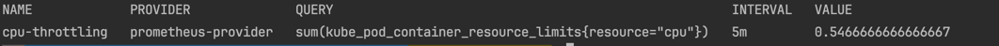

# Scaling kubernetes workloads using HPA + Prometheus + Keptn Metrics

Kubernetes has ways to extend its metrics APIs, but they have limitations, especially that they only allow you to use a single observability platform 
such as Prometheus, Dynatrace or Datadog. The Keptn Metrics Operator solves this problem by providing a
single entry point for all your metrics data, regardless of its source, so you can use multiple instances of multiple observability platforms. Recently I tried
Keptn Metric Operator and HPA exercise and I thought it would be a good idea to share my experience with the community.


## Install Kind Cluster
For this exercise, I will use the `kind` local Kubernetes cluster. You can install it by following the instructions [here](https://kind.sigs.k8s.io/docs/user/quick-start/). After installing `kind`, create a cluster by running the following command:
```bash 
kind create cluster 
```
You should see output similar to the following:


## Install Prometheus
For this exercise we will be using prometheus as our observability platform. I have provided a command for installing 
Prometheus in the Makefile. Navigate to the `install` directory and run the following command. This will install Prometheus in the `monitoring` namespace.
```bash
make install-prometheus
```
Let's verify that Prometheus is installed and collecting metrics from the cluster. First, port-forward Prometheus to your local machine:
```bash
kubectl port-forward svc/prometheus-kube-prometheus-prometheus 9090:9090 -n monitoring
```
Now visit, `http://localhost:9090/` in your browser. You should see the Prometheus UI. Click on `Graph` and enter `kube_pod_container_resource_limits` in the `Expression` field and click on `Execute`. You should see output similar to the following:


## Deploy Podtato Head
Let's deploy the PodtatoHead `podtato-head-entry` service. We will use this app for our demo. The manifest file for PodtatoHead is provided in the `demo` directory. Navigate to the `demo` directory and run the following command:
```bash
kubectl apply -f podtato-head-entry.yaml
```
After applying, please ensure that the application is up and running:
```bash
kubectl get pods -n podtato-kubectl
```
You can also port-forward the PodtatoHead service to your local machine:
```bash
kubectl port-forward svc/podtato-head-entry 9000:9000 -n podtato-kubectl
```
Now, visit `http://localhost:9000/` in your browser, and you should see the PodtatoHead app.


## Install Keptn Metrics Operator
Navigate to the `install` directory and run the following command:
```bash
make install-keptn
```


## Apply Keptn Metrics
Now apply `keptn-metrics.yaml` and `keptn-metrics-provider.yaml` from the `demo` directory:
```bash
kubectl apply -f keptn-metrics.yaml
kubectl apply -f keptn-metrics-provider.yaml
```
View metrics by running the following command:
```bash
kubectl get KeptnMetric -n podtato-kubectl 
```

You should see output similar to the following:


## Apply Horizontal Pod Autoscaler
Now that we are able to retrieve the value of our metric and have it stored in our cluster in the status of our KeptnMetric custom resource, we can configure a `HorizontalPodAutoscaler` to make use of this information and scale our application automatically:
```bash
kubectl apply -f hpa.yaml
```
In our `HPA` configuration, we specified the target to scale our deployment when we get metric value greater that `1`.


Sometimes it takes a while for the pods to scale up. If you don't see the pods scaling up, please wait for a while until the metrics value reaches greater than `1`.
After a while, you should see the pods scaling up:
```bash
kubectl get pods -n podtato-kubectl
```


## Notes
- keptn metric docs https://keptn.sh/latest/docs/reference/crd-reference/metricsprovider/#files
- Keptn + HPA example https://keptn.sh/latest/docs/use-cases/hpa/#set-up-the-horizontalpodautoscaler

